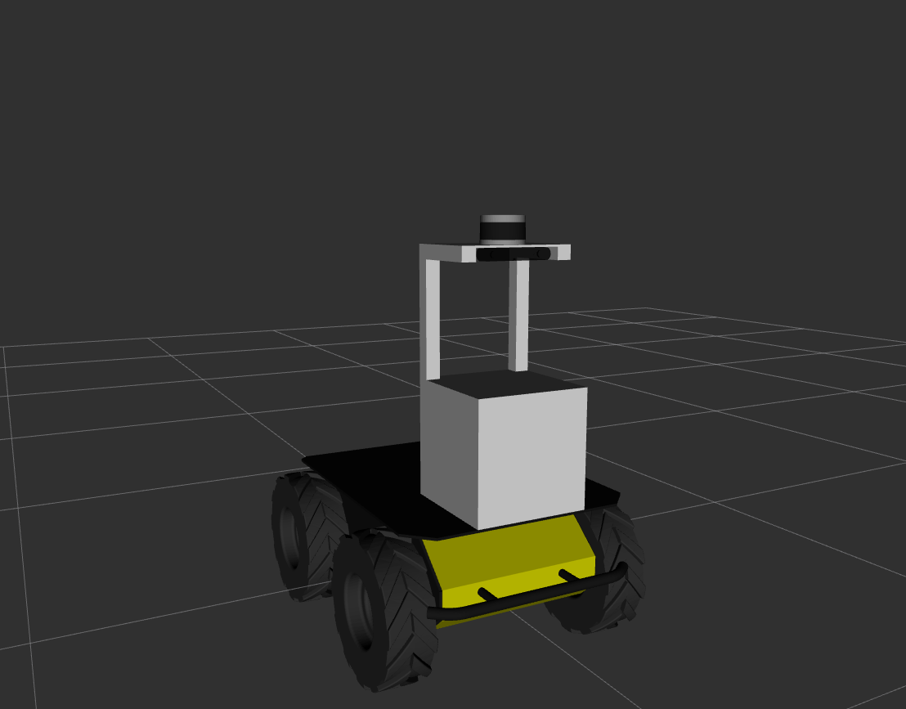

# Agrob calibration

Multi-sensor calibration for Agrob

## Setup

To use this repo you should
- Include the [husky repository](https://github.com/husky/husky) in you ROS catkin_ws.
- Include the [hector_models
  repository](https://github.com/tu-darmstadt-ros-pkg/hector_models) in you ROS catkin_ws.

## Visualize robot model

To visualize the robot model run the following command
```
roslaunch roslaunch agrob_bringup bringup.launch
```

## Expected result


